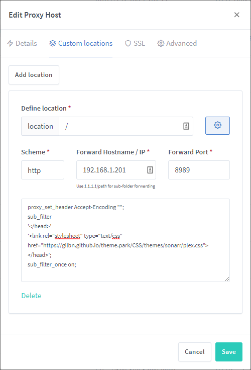

# Setup

## Methods

<ul>
    <li><a href="#docker-mods"> Docker Mods</a><small> Adds the theme locally</small></li>
        <ul><li><a href="#hotio-containers"> Hotio containers</a></li></ul>
        <ul><li><a href="#docker">🐋 Docker image</a><small> Selfhost the CSS files!</small></li></ul>
    <li><a href="#subfilter-method">Subfilter Method</a><small> Injects the theme through a proxy</small></li>
    <ul>
        <li><a href="#nginx">Nginx</a></li>
        <ul>
            <li><a href="#nginx-variable">Nginx Variable</a><small> For easy switching in nginx</small></li>
            <li><a href="#nginx-proxy-manager">Nginx Proxy Manager</a></li>
        </ul>
        <li><a href="#apache">Apache</a></li>
        <li><a href="#caddy">Caddy</a></li>
        <li><a href="#caddy-v2">Caddy V2</a></li>
        <li><a href="https://github.com/traefik/plugin-rewritebody">Traefik:</a> <a
                href="https://github.com/gilbN/theme.park/issues/42">See this issue</a></li>
        <li><a href="#community-themes">Community Themes</a></li>
    </ul>
    <li><a href="#stylus-method">Stylus Method</a><small> Injects the theme through a browser extension</small></li>
    <li><a href="#blackberry-theme-installer-method">Blackberry Theme Installer</a><small> Injects the theme using Javascript (Made for Organizr)</small></li>
</ul>

***


All apps have {{ themes|length }} official [themes](/theme-options/organizr/) and {{ cthemes|length }} [community-themes](/community-themes) to choose from.

`https://theme-park.dev/css/base/<APP_NAME>/<THEME_NAME>.css`

```css

{{ theme }}.css

```

Example: `https://theme-park.dev/css/base/sonarr/dark.css`

## Docker mods

For [linuxserver.io](https://blog.linuxserver.io/2019/09/14/customizing-our-containers) containers to inject theme.park stylesheets.

!!! warning
    Not all apps support this installation method. See the list to the left on the [themes](/themes/sonarr) overview. Look for the 🐳 icon. 

[https://github.com/GilbN/theme.park/tree/master/docker-mods](https://github.com/GilbN/theme.park/tree/master/docker-mods)

This will inject the stylesheet directly into the app. This means that you don't need to use NGINX or stylus. Since it's injected into the HTML in the app, it will work locally too.

Add the variable `DOCKER_MODS=ghcr.io/gilbn/theme.park:<app>` e.g. `ghcr.io/gilbn/theme.park:sonarr`

These are the **default** values for all envs. So if you want to use the `organizr` theme, you only need to add the `DOCKER_MODS` variable.

### Enviroment variables

| Environment Variable | Example Value | Description |
| -------------------- | ------------- | ----------- |
| `DOCKER_MODS` | `ghcr.io/gilbn/theme.park:<app>` | Replace <app\> |
| `TP_DOMAIN` | `theme-park.dev` | `Optional` Defaults to the example. |
| `TP_THEME` | `organizr` | `Optional` The theme you want to use. Defaults to the example. |
| `TP_COMMUNITY_THEME` | `true` | `Optional` Set to true if you are using a [community theme option](/community-themes/) |
| `TP_ADDON` | `radarr-4k-logo` | `Optional` See addon [wiki](/themes/addons/) |
| `TP_SCHEME` | `https` | `Optional` Defaults to example. |
| `TP_HOTIO` | `true` | `Optional` See [Hotio Containers](#hotio-containers)(Setup#-hotio-containers) |
| `TP_DISABLE_THEME` | `true` | `Optional` Only used on some mods (Qbt) |

####  LSIO Example

```yaml
version: "2.1"
services:
  sonarr:
    image: ghcr.io/linuxserver/sonarr
    container_name: sonarr
    environment:
      - PUID=1000
      - PGID=1000
      - TZ=Europe/London
      - DOCKER_MODS=ghcr.io/gilbn/theme.park:sonarr
    volumes:
      - /path/to/data:/config
      - /path/to/media:/media
    ports:
      - 8989:8989
    restart: unless-stopped
```

```bash
docker run -d \
  --name=sonarr \
  -e PUID=1000 \
  -e PGID=1000 \
  -e TZ=Europe/London \
  -e DOCKER_MODS=ghcr.io/gilbn/theme.park:sonarr \
  -p 8989:8989 \
  -v /path/to/data:/config \
  -v /path/to/media:/media \
  --restart unless-stopped \
  ghcr.io/linuxserver/sonarr
```

###  Hotio containers

!!! warning
    The `DOCKER_MODS` variable does not work on Hotio Containers!
    The script must be mounted using a volume mount.

!!! info
    The scripts are located in the `master` branch. [https://github.com/GilbN/theme.park/tree/master/docker-mods](https://github.com/GilbN/theme.park/tree/master/docker-mods)

    Go to `<app>/root/etc/cont-init.d/` to find the different scripts. e.g. [/sonarr/root/etc/cont-init.d/98-themepark](https://github.com/GilbN/theme.park/blob/master/docker-mods/sonarr/root/etc/cont-init.d/98-themepark)

Download and mount your script with the volume `/your/docker/host/98-themepark:/etc/cont-init.d/99-themepark` to execute your script on container start

Add the variable `TP_HOTIO` and set it to `true`.
The script will then use the correct file path inside the Hotio container.

Use the different [Environment variables](#enviroment-variables) above.

#### Hotio Example

```yaml
version: "3.7"

services:
  sonarr:
    container_name: sonarr
    image: hotio/sonarr
    ports:
      - "8989:8989"
    environment:
      - PUID=1000
      - PGID=1000
      - UMASK=002
      - TZ=Etc/UTC
      - TP_HOTIO=true
      - TP_THEME=plex
    volumes:
      - /<host_folder_config>:/config
      - /docker/host/98-themepark:/etc/cont-init.d/99-themepark
```

```bash
docker run --rm \
    --name sonarr \
    -p 8989:8989 \
    -e PUID=1000 \
    -e PGID=1000 \
    -e UMASK=002 \
    -e TZ="Etc/UTC" \
    -e TP_HOTIO="true" \
    -e TP_THEME=plex \
    -v /<host_folder_config>:/config \
    -v /docker/host/98-themepark:/etc/cont-init.d/99-themepark \
    hotio/sonarr
```

[https://hotio.dev/faq/#guides](https://hotio.dev/faq/#guides)

## Docker

There is a docker image available if you want to selfhost the css files instead of of using `https://theme-park.dev`.

### Version Tags

| Tag | Description |
| :----: | --- |
| `latest` | Based on latest release on the `main` branch |
| `develop` | Based on latest commit on the `develop` branch |
| `x.x.x` | Based on latest version tag released on github |

The architectures supported by this image are:

| Architecture | |Tags||
| :----: | --- |---|---|
| linux/amd64 | latest|develop|x.x.x |
| linux/arm64 | latest|develop|x.x.x |
| linux/arm/v7 | latest|develop|x.x.x |

### Application Setup

CSS files can be accessed on `<your-ip>:<port>/css/base/<app>/<app>-base.css` or `<your-ip>:<port>/css/base/<app>/<theme>.css`

All the CSS files can be located in `/config/www/css`

If you want to add a custom theme option, you can add in `/config/www/css/theme-options` and restart the container. The container will run the `themes.py` and create all the theme option files in the different base folders.

Then you can load the css by going to `<your-ip>:<port>/css/base/<app>/your-custom-theme.css`

If you want to access the files using your domain, add the `TP_DOMAIN` env, and reverse proxy the container.

All files will then reference that domain internally.

!!! note
    If you want to use `DOCKER_MODS` and this container locally without a domain, you can add the `TP_SCHEME=http` env to the container you have added the `DOCKER_MODS` env to.

```yaml
version: "2.1"
services:
  theme-park:
    image: ghcr.io/gilbn/theme.park
    container_name: theme-park
    environment:
      - PUID=1000
      - PGID=1000
      - TZ=Europe/London
      - TP_DOMAIN=yourdomain.com #optional
      - TP_SCHEME=https #optional
    volumes:
      - /path/to/data:/config #optional
    ports:
      - 8080:80
      - 4443:443
    restart: unless-stopped
```

```bash
docker run -d \
  --name=theme-park \
  -e PUID=1000 \
  -e PGID=1000 \
  -e TZ=Europe/London \
  -e TP_DOMAIN=yourdomain.com `#optional` \
  -e TP_SCHEME=https `#optional` \
  -p 8080:80 \
  -p 4443:443 \
  -v /path/to/data:/config `#optional` \
  --restart unless-stopped \
  ghcr.io/theme.park
```

### Parameters

| Parameter | Function |
| :----: | --- |
| `-p 8080` | HTTP web gui |
| `-p 4443` | HTTPS web gui |
| `-e PUID=1000` | for UserID - see below for explanation |
| `-e PGID=1000` | for GroupID - see below for explanation |
| `-e TZ=Europe/London` | Specify a timezone to use EG Europe/London |
| `-e TP_DOMAIN=yourdomain.com` | Optional - Add your own domain. Default to `$http_host` |
| `-e TP_SCHEME=https` | Optional - If this optional variable is set, the `TP_DOMAIN` domain will be set to use this URI scheme internally in the css files. Default is `$scheme`. |
| `-e TP_URLBASE=subfolder`| Optional - This will make the CSS files accessible on a subfolder instead of the root. ex `domain.com/themepark/css/base/plex/overseerr.css`|
| `-v /config` | Contains all relevant configuration files. |

!!! danger "Reverse proxy HTTPS"
    When reverse proxying using **HTTPS** you must either reverse proxy the **HTTPS** port of the **theme-park** container OR add the `TP_SCHEME` env and set it to `https`

#### Reverse proxy example

```nginx
server {
    listen 80;
    server_name themes.yourdomain.com;
    return 301 https://$server_name;
}
server {
    listen 443 ssl;
    listen [::]:443 ssl;
    server_name themes.yourdomain.com;

    location / {
    proxy_set_header Host $host; # By Using this you don't need to use TP_DOMAIN as the $host var gets passed to the upstream.
    proxy_pass http://192.168.1.34:8080;
    }
}
```

#### Reverse proxy example subfolder

```nginx
}
location /themes {
    return 301 $scheme://$host/themes/;
}
location ^~ /themes/ {
    set $upstream_app theme-park;
    set $upstream_port 443;
    set $upstream_proto https;
    proxy_set_header Host $host;
    proxy_pass $upstream_proto://$upstream_app:$upstream_port;
}
```

#### Docker mods local example

```yaml
version: "2.1"
services:
  sonarr:
    image: ghcr.io/linuxserver/sonarr
    container_name: sonarr
    environment:
      - PUID=1000
      - PGID=1000
      - TZ=Europe/London
      - DOCKER_MODS=ghcr.io/gilbn/theme.park:sonarr
      - TP_SCHEME=http
      - TP_DOMAIN=192.168.1.99:8080\/themepark # forward slash needs to be escaped with a \
    volumes:
      - /path/to/data:/config
      - /path/to/media:/media
    ports:
      - 8989:8989
    restart: unless-stopped
  theme-park:
    image: ghcr.io/gilbn/theme.park
    container_name: theme-park
    environment:
      - PUID=1000
      - PGID=1000
      - TZ=Europe/London
      - TP_URLBASE=themepark
    volumes:
      - /path/to/data:/config
    ports:
      - 8080:80
    restart: unless-stopped
```

## Subfilter method

As  most of these apps doesn't have support for custom CSS. You can get around that by using the [subfilter](http://nginx.org/en/docs/http/ngx_http_sub_module.html) module in NGINX or similar modules for other webservers.

!!! info
    If you don't know how to reverse proxy an application, please read this first. It's a really great article and will help you understand all the pieces!

    [https://blog.linuxserver.io/2019/04/25 letsencrypt-nginx-starter-guide/](https://blog.linuxserver.io/2019/04/25/letsencrypt-nginx-starter-guide/) and [https://docs.linuxserver.io/general/swag/](https://docs.linuxserver.io/general/swag/)

### Nginx

Add this to your reverse proxy:

!!! warning
    Make sure to add the config before any rewrites and not inside any **`/api`** location blocks!

```nginx
proxy_set_header Accept-Encoding "";
sub_filter
'</head>'
'<link rel="stylesheet" type="text/css" href="https://theme-park.dev/css/base/<APP_NAME>/<THEME>.css">
</head>';
sub_filter_once on;
```

Where `APP_NAME` is the app you want to theme and `THEME` is the name of the theme. e.g. `aquamarine`

#### Nginx Example

```nginx
location /sonarr {
    proxy_pass http://localhost:8989/sonarr;
    include /config/nginx/proxy.conf;
    proxy_set_header Accept-Encoding "";
    sub_filter
    '</head>'
    '<link rel="stylesheet" type="text/css" href="https://theme-park.dev/css/base/sonarr/plex.css">
    </head>';
    sub_filter_once on;
  }
```

### Nginx Variable

You can also setup NGINX to use variables to change the themes. This will update the theme on all your location blocks by just changing 1 variable. This is nice if you quickly want to change colors on all of your apps.

#### http block

In your http block add the following:

```nginx
# THEME.PARK
map $host $theme {
    default <theme>; # e.g. default organizr
}
```

Change `<theme>` to the theme you want on all your apps. e.g. `default nord;`

#### theme-park.conf

Next create a new file called `theme-park.conf` and add the following code: (Note: It's not really necessary to create the conf file but I think it looks cleaner in the location blocks)

!!! warning
    Make sure to add the config before any rewrites and not inside any /api location blocks!

```nginx
    proxy_set_header Accept-Encoding "";
    sub_filter
    '</head>'
    '<link rel="stylesheet" type="text/css" href="https://theme-park.dev/css/base/$app/$theme.css">
    </head>';
    sub_filter_once on;
```

As you can see the URL has variables in it `$app.css` and `$theme.css`
The `$theme` variable is set in the http block and will affect all server blocks. And the `$app` variable is set in the location block.

#### Location blocks

Now in the location block use the include syntax and include the `theme-park.conf` file and set the `$app` variable, like so:

```nginx
    set $app <app>;
    include /config/nginx/theme-park.conf;
```

#### Sonarr Example

```nginx
location /sonarr {
    proxy_pass http://192.168.1.34:8990/sonarr;
    proxy_set_header X-Real-IP $remote_addr;
    proxy_set_header X-Forwarded-For $proxy_add_x_forwarded_for;
    proxy_set_header X-Forwarded-Proto $scheme;
    proxy_redirect off;
    proxy_buffering off;
    proxy_http_version 1.1;
    proxy_no_cache $cookie_session;
    set $app sonarr;
    include /config/nginx/theme-park.conf;
}
```

Now when you change the variable in the http block and restart NGINX, it will update the theme for all your apps!

### Nginx Proxy Manager

If you're using Nginx Proxy Manager you can follow these steps:

1. Go the Proxy Hosts list in NPM, and click the three dots on the rightmost side of the host you want to add a theme to. Select 'Edit' from the menu that appears (first item). Within the edit menu go to 'Custom locations' (second tab). In that tab click 'Add location', which will show the 'Define location' options.
2. Enter '/' in the location bar, and then click the gear to the right of it. That will open the box at the bottom where Nginx config code can be added.
3. Fill in the details of the host you're forwarding to. These should be the same as the ones you filled in when you created the host (i.e. the same as in the 'Details' tab (first tab) in the edit menu).
4. Add the code below to the box at the bottom of the edit menu window. Don't forget to update the `<APP_NAME>` and `<THEME>` with the correct app and theme.

```nginx
proxy_set_header Accept-Encoding "";
sub_filter
'</head>'
'<link rel="stylesheet" type="text/css" href="https://theme-park.dev/css/base/<APP_NAME>/<THEME>.css">
</head>';
sub_filter_once on;
```



### Apache

```apache
RequestHeader unset Accept-Encoding
AddOutputFilterByType SUBSTITUTE text/html
Substitute 's|</head>|<link rel="stylesheet" type="text/css" href="https://theme-park.dev/css/base/<APP_NAME>/<THEME>.css"></head>|ni'
```

#### Apache Example

```apache
<Location /sonarr>
    ProxyPass http://localhost:8989/sonarr
    ProxyPassReverse http://localhost:8989/sonarr
    RequestHeader unset Accept-Encoding
    AddOutputFilterByType SUBSTITUTE text/html
     Substitute 's|</head>|<link rel="stylesheet" type="text/css" href="https://theme-park.dev/css/base/sonarr/nord.css"></head>|ni'
  </Location>
```

### Caddy

```nginx
filter rule {
    content_type text/html.*
    search_pattern </head>
    replacement "<link rel='stylesheet' type='text/css' href='https://theme-park.dev/css/base/<APP_NAME>/<THEME>.css'></head>"
}
```

#### Caddy Example

```nginx
proxy /tautulli 127.0.0.1:8181 {
    header_upstream Host {host}
    header_upstream X-Real-IP {remote}
    header_upstream X-Forwarded-For {remote}
    header_upstream X-Forwarded-Proto {scheme}
    header_upstream X-Forwarded-Host {host}
    header_upstream X-Forwarded-Ssl {on}
    filter rule {
        content_type text/html.*
        search_pattern </head>
        replacement "<link rel='stylesheet' type='text/css' href='https://theme-park.dev/css/base/tautulli/nord.css'></head>"
        }
    }
```

#### Caddy Docker labels

```json
"caddy.filter": "rule"
"caddy.filter.content_type": "text/html.*"
"caddy.filter.search_pattern": "</head>"
"caddy.filter.replacement": "\"<link rel='stylesheet' type='text/css' href='https://theme-park.dev/css/base/tautulli/nord.css'></head>\""
```

### Caddy v2

>
!!! info
    Thank you [jef](https://github.com/jef) for the write up!

We rely on sjtug's [caddy2-filter](https://github.com/sjtug/caddy2-filter) as Caddy v2 does not have filtering as of now.

There are two ways to [extend Caddy](https://caddyserver.com/docs/extending-caddy):

- [Docker](https://hub.docker.com/_/caddy)
- [Bare metal](https://caddyserver.com/docs/download)

#### Docker

You will have to create your own Caddy image that includes the `caddy2-filter`.

`Dockerfile`:

```docker
FROM caddy:2.0.0-builder AS builder

RUN caddy-builder \
    github.com/sjtug/caddy2-filter

FROM caddy:2.0.0

COPY --from=builder /usr/bin/caddy /usr/bin/caddy
```

Then run `docker build -t caddy:latest .` to build the image. After we update the `Caddyfile` below, we can (re)start the container by running `docker run -d -p 80:80 -p 443:443 caddy:latest` as an example.

#### Bare metal

!!! info
    Make sure you install [xcaddy](https://github.com/caddyserver/xcaddy) to add modules to Caddy.

Then install the `caddy2-filter` module by using:

```sh
xcaddy build \
    --with github.com/sjtug/caddy2-filter
```

You can confirm the module is available by using `xcaddy list-modules`.

#### Updating the `Caddyfile`

Almost like Caddy v1, here is an example `filter` we need to include in the all the services we want themed:

```nginx
filter {
    content_type text/html.*
    search_pattern </head>
    replacement "<link rel='stylesheet' type='text/css' href='https://theme-park.dev/css/base/<APP_NAME>/<THEME>.css'></head>"
}
```

With `caddy2-filter`, we need to also add this option in the global option block:

```nginx
{
order filter after encode
}
```

And if you're using a reverse proxy, you also need to include `header_up -Accept-Encoding` in the `reverse_proxy` directive body.

??? example "Full example of a Caddyfile"
    === "caddy"

    ```nginx
        {
            order filter after encode
        }
            radarr.example.com {
            encode zstd gzip
            reverse_proxy 127.0.0.1:7878 {
            header_up -Accept-Encoding
        }
        filter {
            content_type text/html.*
            search_pattern </head>
            replacement "<link rel='stylesheet' type='text/css' href='https://theme-park.dev/css/base/radarr/nord.css'></head>"
            }
    }
    ```

!!! note
    :point_right: If your service requires you to ignore a header, use the `header_down` subdirective in the `reverse_proxy` directive. For example, qBittorrent usage would look like this:

```nginx
reverse_proxy 127.0.0.1:8080 {
    header_up -Accept-Encoding
    header_down -x-webkit-csp
    header_down -content-security-policy
}
```

#### Subfolder/directory example

```nginx
    route /sonarr/* {
        filter {
            content_type text/html.*
            search_pattern </head>
            replacement "<link rel='stylesheet' type='text/css' href='https://theme-park.dev/css/base/sonarr/nord.css'></head>"
        }

        reverse_proxy /sonarr/* http://sonarr:8989 {
            header_up -Accept-Encoding
            header_down -x-webkit-csp
            header_down -content-security-policy
        }
    }
```

Feel free to make any adjustments! Thanks everyone for the help!

Also for reference: [Caddy v2 structure](https://caddyserver.com/docs/caddyfile/concepts#structure)

## Stylus method

Stylus is a browser extention that can inject custom css to the webpage of your choosing.

Add this in the style page:

```css
@import "https://theme-park.dev/css/base/<APP_NAME>/<THEME>.css";
```

Example:

```css
@import "https://theme-park.dev/css/base/sonarr/nord.css";
```


Link to Chrome extention:

[https://chrome.google.com/webstore/detail/stylus/clngdbkpkpeebahjckkjfobafhncgmne?hl=en](https://chrome.google.com/webstore/detail/stylus/clngdbkpkpeebahjckkjfobafhncgmne?hl=en)

Link to Firefox extention:

[https://addons.mozilla.org/en-US/firefox/addon/styl-us/](https://addons.mozilla.org/en-US/firefox/addon/styl-us/)

## Blackberry Theme Installer method

[Blackberry Themes](https://github.com/Archmonger/Blackberry-Themes) provides a easy to use method of using JS to theme your Organizr tabs. This will only work if your Organizr tab is on a subdirectory (does not work with subdomains). These themes will only be applied when viewed within Organizr.

```js
$.getScript('https://archmonger.github.io/Blackberry-Themes/Extras/theme_installer.js', function(){
    // First variable is your Organizr tab name. Second variable is a link to the theme you want to apply.
    themeInstaller("<TAB_NAME>","https://theme-park.dev/css/base/<APP_NAME>/<THEME_NAME>.css");

    // You can also use this for multiple themes at once by simply calling themeInstaller again!
    themeInstaller("<TAB_NAME>","https://theme-park.dev/css/base/<APP_NAME>/<THEME_NAME>.css");
});
```

## Develop

To use the develop branch you will need to replace the domain with `develop.theme-park.dev`.

```nginx
proxy_set_header Accept-Encoding "";
sub_filter
'</head>'
'<link rel="stylesheet" type="text/css" href="https://develop.theme-park.dev/css/base/<APP_NAME>/<THEME>.css">
</head>';
sub_filter_once on;
```

Docker mods: `-e TP_DOMAIN=develop.theme-park.dev`
