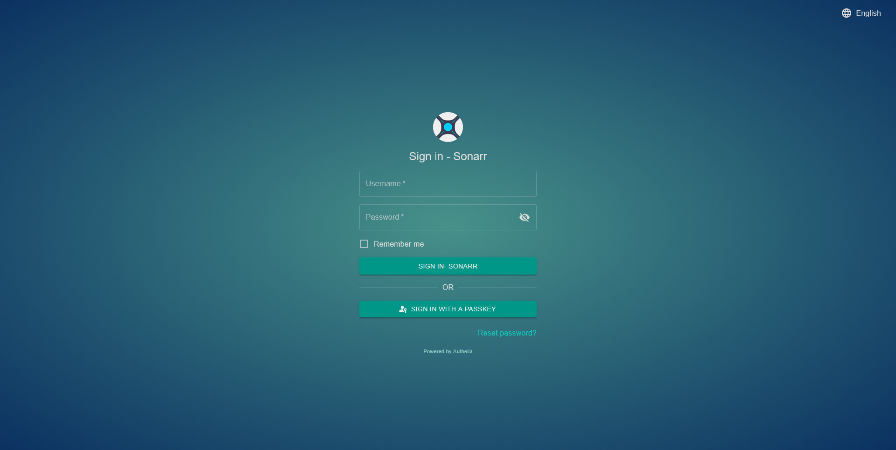
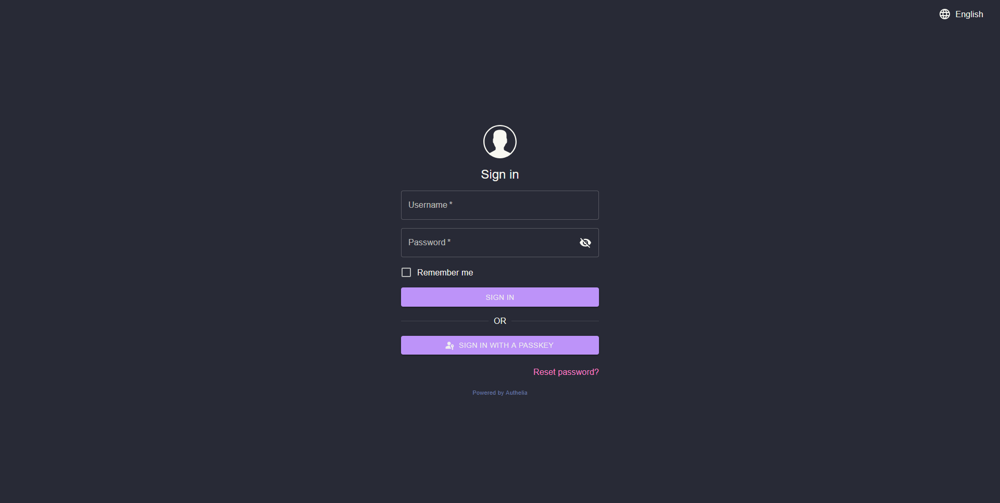

# Authelia Logos

This is a collection of addons that allow you to modify the authelia login page with the logo of an app. By using the routing functions of a reverse proxy such as Traefik, you can apply this addon when using ForwardAuth to log in to an app. This can be useful for making it clearer to a user (or yourself) what app is being logged into. Unfortunately, there doesn't seem to be a way to apply this to oidc logins.

The following logo options are currently available:
```
authelia-bazarr-logo
authelia-jellyfin-logo
authelia-jellyseerr-logo
authelia-komga-logo
authelia-lidarr-logo
authelia-lldap-logo
authelia-mylar-logo
authelia-photoprism-logo
authelia-pihole-logo
authelia-prowlarr-logo
authelia-qbittorrent-logo
authelia-radarr-logo
authelia-romm-logo
authelia-sabnzbd-logo
authelia-sonarr-logo
authelia-traefik-logo
```

Here is an example of using a custom traefik router and the traefik-themepark middleware addon to set a different theme and addon on a sonarr login, while still having a seperate theme in Authelia.

Replace auth.example.com with your Authelia instance url, and sonarr.example.com with your sonarr instance url.

```traefik
    # Authelia Theme
    - "traefik.http.routers.authelia.rule=Host(`auth.example.com`)"
    - "traefik.http.routers.authelia.middlewares=themepark-authelia@docker"
    - "traefik.http.middlewares.themepark-authelia.plugin.themepark.app=authelia"
    - "traefik.http.middlewares.themepark-authelia.plugin.themepark.theme=dracula"
    # Authelia Sonarr Login Page Theme
    - "traefik.http.middlewares.authelia-sonarr.plugin.themepark.app=authelia"
    - "traefik.http.middlewares.authelia-sonarr.plugin.themepark.theme=aquamarine"
    - "traefik.http.middlewares.authelia-sonarr.plugin.themepark.addons=sonarr-logo"
    - "traefik.http.routers.authelia-sonarr.middlewares=authelia-sonarr@docker"
    - "traefik.http.routers.authelia-sonarr.entrypoints=https"
    - "traefik.http.routers.authelia-sonarr.rule=Host(`auth.example.com`) && QueryRegexp(`rd`, `.*sonarr.example.com.*`)"
```

That will give you this result, with your sonarr login (sonarr.example.com) having a seperate theme and the logo, and your base authelia login (auth.example.com) having its own theming and the base Authelia logo:


<div class="row">
<p><a href="addon-example.png" rel="noopener"></a></p>
<p><a href="authelia-dracula.png" rel="noopener"></a></p>
</div>

To apply your own default Authelia logo, or modify some of the strings such as changing "Sign in" to "Sign in to {Your Domain}", see the Authelia [Server Asset Overrides](https://www.authelia.com/reference/guides/server-asset-overrides/) documentation.




