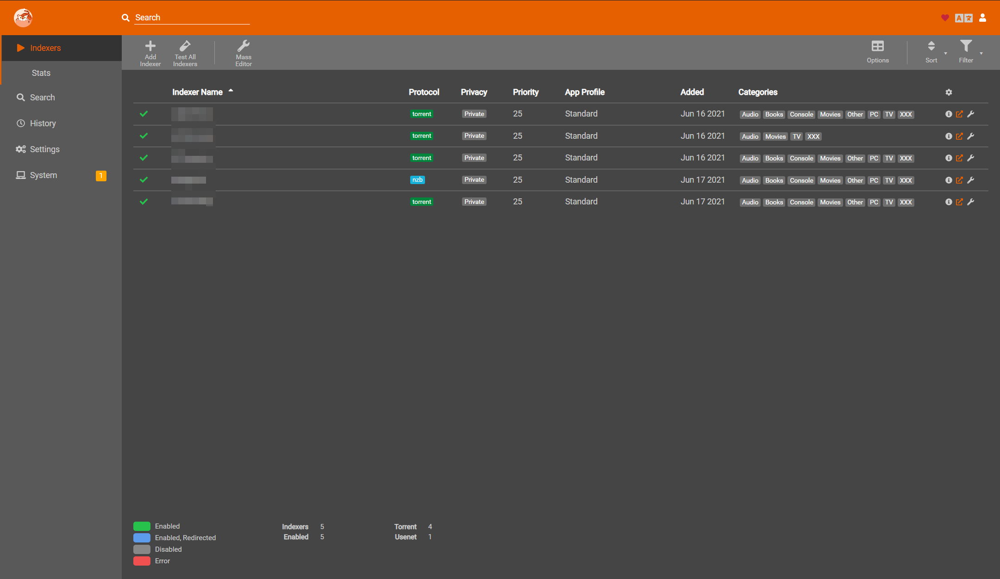

# Prowlarr Darker

A darker theme for Prowlarr that uses the same accents and colors as the default theme

<p>
<a href="screenshot1.png" rel="noopener"></a>
</p>

## Setup

### Docker mod

`-e TP_ADDON=prowlarr-darker`

If adding multiple mods, enter them in an array separated by  `|`. `-e TP_ADDON=addon1|addon2`

### Nginx

Examples of how to add it:

```nginx
proxy_set_header Accept-Encoding "";
sub_filter
'</head>'
'<link rel="stylesheet" type="text/css" href="https://theme-park.dev/css/base/prowlarr/prowlarr-base.css">
<link rel="stylesheet" type="text/css" href="https://theme-park.dev/CSS/addons/prowlarr/prowlarr-darker/prowlarr-darker.css">
</head>';
sub_filter_once on;
```

### Apache

```nginx
AddOutputFilterByType SUBSTITUTE text/html
   Substitute 's|</head> '<link rel="stylesheet" type="text/css" href="https://theme-park.dev/css/base/prowlarr/prowlarr-base.css"><link rel="stylesheet" type="text/css" href="https://theme-park.dev/CSS/addons/prowlarr/prowlarr-darker/prowlarr-darker.css">
</head>';|'
```

### Caddy

```nginx
filter rule {
    content_type text/html.*
    search_pattern </head>
    replacement "<link rel='stylesheet' type='text/css' href='https://theme-park.dev/css/base/prowlarr/prowlarr-base.css'><link rel='stylesheet' type='text/css' href='https://theme-park.dev/CSS/addons/prowlarr/prowlarr-darker/prowlarr-darker.css'></head>"
}
```

### Stylus

Just add another import line.

```css
@import "https://theme-park.dev/css/base/prowlarr/prowlarr-base.css";
@import "https://theme-park.dev/CSS/addons/prowlarr/prowlarr-darker/prowlarr-darker.css";
```
