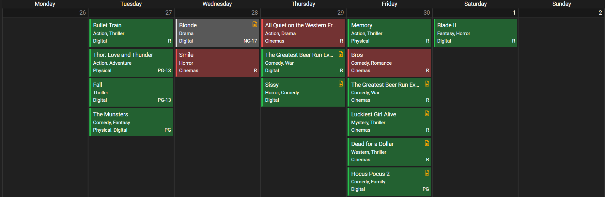

# Radarr Alt Calendar

Alternative calendar colors.

<p>
<a href="screenshot1.png" rel="noopener"></a>
</p>

## Setup

### Docker mod

`-e TP_ADDON=radarr-alt-calendar`

If adding multiple mods, enter them in an array separated by  `|`. `-e TP_ADDON=addon1|addon2`

### Nginx

Examples of how to add it:

```nginx
proxy_set_header Accept-Encoding "";
sub_filter
'</head>'
'<link rel="stylesheet" type="text/css" href="https://theme-park.dev/css/base/radarr/radarr-base.css">
<link rel="stylesheet" type="text/css" href="https://theme-park.dev/css/addons/radarr/radarr-alt-calendar/radarr-alt-calendar.css">
</head>';
sub_filter_once on;
```

### Apache

```nginx
AddOutputFilterByType SUBSTITUTE text/html
   Substitute 's|</head> '<link rel="stylesheet" type="text/css" href="https://theme-park.dev/css/base/radarr/radarr-base.css"><link rel="stylesheet" type="text/css" href="https://theme-park.dev/css/addons/radarr/radarr-alt-calendar/radarr-alt-calendar.css">
</head>';|'
```

### Caddy

```nginx
filter rule {
    content_type text/html.*
    search_pattern </head>
    replacement "<link rel='stylesheet' type='text/css' href='https://theme-park.dev/css/base/radarr/radarr-base.css'><link rel='stylesheet' type='text/css' href='https://theme-park.dev/css/addons/radarr/radarr-alt-calendar/radarr-alt-calendar.css'></head>"
}
```

### Stylus

Just add another import line.

```css
@import "https://theme-park.dev/css/base/radarr/radarr-base.css";
@import "https://theme-park.dev/css/addons/radarr/radarr-alt-calendar/radarr-alt-calendar.css";
```

### Traefik

>
!!! warning
    Added in traefik-themepark version `v1.2.0`

Use <a href="/setup/#traefik" rel="noopener">traefik-themepark middleware</a>.

```yaml
middlewares:
    radarr-alt-calendar:
        plugin:
            themepark:
                app: radarr
                theme: base
                addons:
                    - alt-calendar
```
