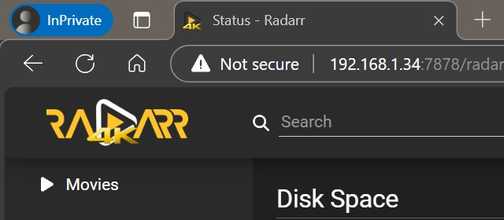

# Radarr 4K Favicon




The addon will change the favicon in the browser and icon on mobile etc.

!!! info
    Implementation is through docker-mods/scripts.
    
    `-e TP_ADDON={{ addon_name }}`

    If adding multiple mods, enter them in an array separated by  `|`. `-e TP_ADDON=addon1|addon2`

Or you can just replace the files in /app/bin/UI/Content/Images/Icons

The files can be found in the addons folder: https://github.com/themepark-dev/theme.park/tree/develop/css/addons/radarr

