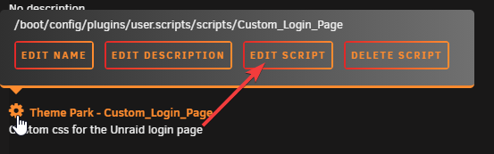

<h1 align="left">  Alien</h1>

Custom Alien themed css for the Unraid login page.

## 🛠️ Installation

**Recommended way:**

Install using the [bash script](https://github.com/gilbN/theme.park/blob/master/CSS/addons/unraid/login-page/custom_login.sh) and the plugin [CA User Scripts](https://forums.unraid.net/topic/48286-plugin-ca-user-scripts/)

Add a new user script by clicking `Add new script`


Give it a name and click OK


Click or hover over the gear icon and click `Edit Script`



Paste the contents of the bash script: [custom_login.sh](https://github.com/gilbN/theme.park/blob/master/CSS/addons/unraid/login-page/custom_login.sh)

Below the shebang(`#!/bin/bash`) are the variables you need to change for the different themes.


The values are the ones below. For the Alien themes, remember to change the `TYPE` variable to `alien`. The default value in the bash script is `retro-terminal`

Remember to also set `ADD_JS` to `false` if you are not using the `isolation_video.css` theme.

```bash
TYPE="alien"
THEME="hallway2.css"
DOMAIN="gilbn.github.io"
ADD_JS="false"
JS="isolation.js"
DISABLE_THEME="false"
```

### Available theme colors

See [screenshots](#screenshots) at the bottom.

Available wallpapers [Wallpapers](https://github.com/gilbN/theme.park/tree/master/CSS/addons/unraid/login-page/alien/wallpaper)

```css
hallway.css
hallway2.css
hallway3.css
hallway4.css
isolation.css
isolation_video.css
scanner.css
nightmare.css
custom.css /* Make it your own */
```

Set the values to what you like, and click `Save Changes`

To have the script applied at every boot, set the schedule to `At Startup of Array`

Now just click `Run Script` and it will print some text in the window.


Thats it.. logout and have a look at your new theme :)

### Javascript

You can also  inject an animated video wallpaper from the Isolation video game.

1. Set `THEME` to `isolation_video.css`
2. Set `ADD_JS`to `"true"` to enable.

⚠️⚠️⚠️

***HEY! You are injecting javascript into the login page for your precious server!***

***You should probably have a look at the content of that file, and probably host it yourself 💀***

[isolation.js](https://github.com/gilbN/theme.park/blob/master/CSS/addons/unraid/login-page/alien/js/isolation.js)

⚠️⚠️⚠️


## FAQ

### Backups

The script will create a backup of the login.php file if one does not exist.

### Uninstall/Restore the original

To uninstall the theme set the variable `DISABLE_THEME` to `"true"`

### Can I selfhost this?

Of course!  Just clone the repo into your webserver. Remember to change the `DOMAIN` variable in the bash script.

### My server is not connected to the internet! How can I add this?

With the current version of the bash script, that is not possible as it injects the stylesheet using the a URL and not a file path.
However, nothing is stopping you from just doing some small changes to the script and replace the `href` urls to the path you stored the files.
I will try and create a version of the script that is made for local hosting in the future.

### 🤬 I don't like XYZ !! 🤬

To change the colors,background, logo ect you need to edit the css file. Now since you don't have any control over those files, you'll need to fork it and setup Github pages or selfhost the files. You can't use the raw link from Github, as they don't pass the mime types.

If you use stylus you can just replace a variable you want to change.

```css
@import url(https://gilbn.github.io/theme.park/CSS/addons/unraid/login-page/alien/isolation.css);
:root {
--logo: url(https://domain.com/your-snowflake-logo-here.png) center no-repeat;
}
```

#### Available CSS variables

```css
:root {
    --main-bg: radial-gradient(ellipse at center,rgba(0, 255, 119, 0.1) 0,rgba(0,255,119,0) 100%) center center/cover no-repeat fixed, 
    url(https://gilbn.github.io/theme.park/CSS/addons/unraid/login-page/alien/wallpaper/hallway.jpg) center center/cover no-repeat fixed;
    --logo: url(https://gilbn.github.io/theme.park/CSS/addons/unraid/login-page/alien/logo/wings_green.png) center no-repeat;
    --text-color: #37f592;
    --input-color: #37f592;
    --link-color: #37f592;
    --link-color-hover: #68ffff;
    --case-color: #37f592;
    --button-text-color: #37f592;
    --button-text-color-hover: #000;
    --button-color: #37f592;
    --button-color2: #0C833D;
    --button-color-hover: #68ffff;
    --button-color2-hover: #68ffff;
    --input-font: 'Share Tech Mono', monospace;
    --text-font: 'Share Tech Mono', monospace;   /*'VT323', 'Share Tech Mono'*/
    --div-background-color-15: rgba(0, 255, 111, 0.03);
    --text-shadow: 0 0 8px;
    --box-shadow: 0 0 15px;
}
```

***

The themes can also be added using the Stylus plugin or subfiltering with a webserver

Link to wiki: [Setup](/setup)

#### Screenshots

<p align="center">
    <a href="../alien/screenshots/hallway.png" rel="noopener"></a>
    <a href="../alien/screenshots/hallway2.png" rel="noopener"></a>
    <a href="../alien/screenshots/hallway3.png" rel="noopener"></a>
    <a href="../alien/screenshots/hallway4.png" rel="noopener"></a>
    <a href="../alien/screenshots/isolation.png" rel="noopener"></a>
    <a href="../alien/screenshots/scanner.png" rel="noopener"></a>
    <a href="../alien/screenshots/nightmare.png" rel="noopener"></a>
</p>
