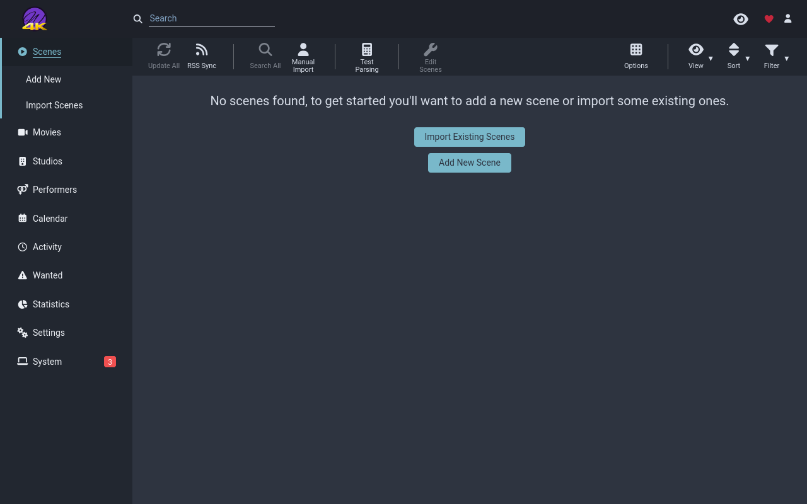
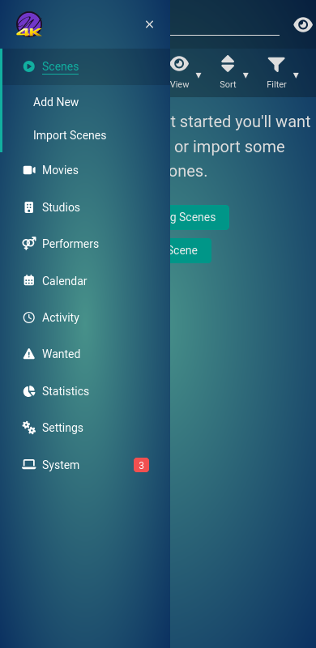

# Whisparr 4K logo

Adds the gold 4K mark to the purple Whisparr logo in the header, mobile menu,
loading screen, and login page. Supports Whisparr v2 and v3.





## Setup

### Docker mod and Hotio

Add `TP_ADDON=whisparr-4k-logo` to your existing theme.park configuration and
recreate the container. Separate multiple addons with `|`.

For Hotio, follow the [startup script setup](../../../../setup/index.md#hotio-containers-s6-overlay-v3-images)
and set `TP_HOTIO=true`.

### Reverse proxy

Add this stylesheet after your Whisparr theme:

```html
<link rel="stylesheet" href="https://theme-park.dev/css/addons/whisparr/whisparr-4k-logo/whisparr-4k-logo.css">
```

Inject before `</body>`, as required by the [Whisparr setup](../../../whisparr.md).

### Stylus

Add this import after your theme import:

```css
@import url("https://theme-park.dev/css/addons/whisparr/whisparr-4k-logo/whisparr-4k-logo.css");
```
